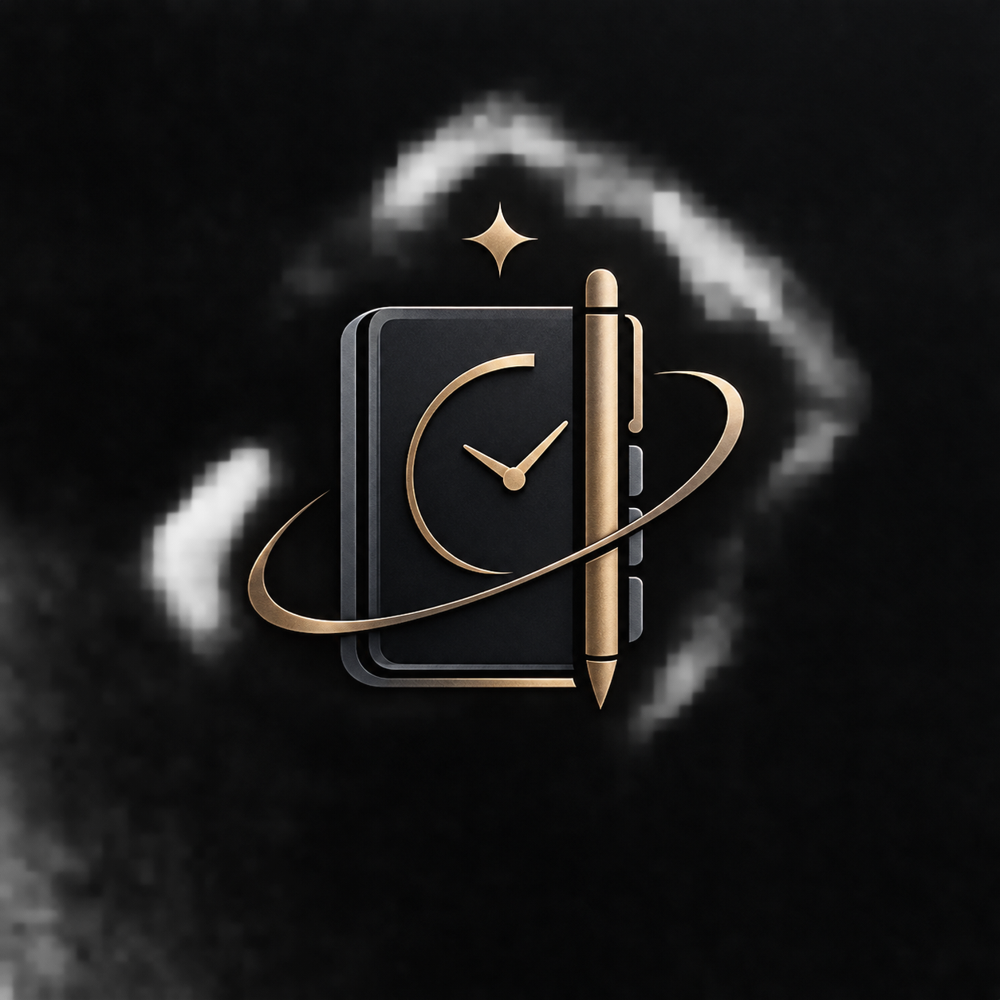

# Study_Planner
<div align="center">

# 📚 Study Planner

### A modern desktop study planning application



<br>

**Plan smarter · Study better · Stay organized**

[English](#english) · [فارسی](#فارسی)

</div>

---

<a name="english"></a>

# 🇬🇧 English

## About

**Study Planner** is a modern desktop application designed to help students organize their study schedule, manage tasks, and keep track of their academic plans in one place.

The application combines a clean interface with a web-based UI running as a desktop application through **pywebview**.

---

## ✨ Features

* 📅 Study planning and scheduling
* ✅ Task and study-session management
* 📊 Organized academic workflow
* 🖥️ Desktop application interface
* 🌐 HTML & CSS based interface
* ⚡ Lightweight and fast
* 📦 Standalone Windows executable
* 🎨 Custom application branding
* 🔒 Local application architecture
* 🧩 Modular project structure

---

## 🛠️ Technologies

<div align="center">


</div>

---

## 📁 Project Structure

```text
study_planner/
│
├── app/
│   ├── static/
│   │   ├── css/
│   │   ├── js/
│   │   └── img/
│   │
│   └── templates/
│
├── assets/
│   └── planner-preview.png
│
├── tools/
│   └── build_exe.py
│
├── build/
│   └── ...
│
├── run.py
├── Planner.iss
└── README.md
```

---

## 🚀 Run the Project

Clone the repository:

```bash
git clone https://github.com/YOUR_USERNAME/YOUR_REPOSITORY.git
cd study_planner
```

Install the required dependencies:

```bash
pip install -r requirements.txt
```

Run the application:

```bash
python run.py
```

---

## 📦 Build Windows Application

The project uses **Nuitka** to create a standalone Windows application.

```bash
python tools/build_exe.py
```

The compiled application will be generated inside:

```text
build/run.dist/
```

The main executable is:

```text
Planner.exe
```

---

## 🧰 Create Installer

The Windows installer is created using **Inno Setup**.

The installer configuration is located at:

```text
Planner.iss
```

The final installer is generated inside:

```text
installer/
```

---

## 🖼️ Preview

<div align="center">


</div>

---

## 📌 Project Status

**Development**

The project is actively being developed and improved.

---

## 👨‍💻 Developer

Built with Python, HTML, CSS and JavaScript.

---

<a name="فارسی"></a>

# 🇮🇷 فارسی

## درباره پروژه

**Study Planner** یک برنامه دسکتاپ مدرن برای برنامه‌ریزی و مدیریت مطالعه است که با هدف ساده‌تر کردن مدیریت برنامه‌های درسی، وظایف و جلسات مطالعه ساخته شده است.

رابط کاربری پروژه با استفاده از **HTML و CSS** طراحی شده و به کمک **pywebview** به صورت یک برنامه دسکتاپ اجرا می‌شود.

---

## ✨ امکانات

* 📅 برنامه‌ریزی مطالعه
* ✅ مدیریت وظایف و جلسات مطالعه
* 📊 مدیریت منظم برنامه‌های درسی
* 🖥️ رابط کاربری دسکتاپ
* 🌐 رابط ساخته‌شده با HTML و CSS
* ⚡ سبک و سریع
* 📦 قابلیت ساخت فایل اجرایی مستقل برای ویندوز
* 🎨 لوگو و هویت بصری اختصاصی
* 🔒 معماری محلی برنامه
* 🧩 ساختار ماژولار پروژه

---

## 🛠️ تکنولوژی‌های استفاده‌شده

<div align="center">


</div>

---

## 📁 ساختار پروژه

```text
study_planner/
│
├── app/
│   ├── static/
│   │   ├── css/
│   │   ├── js/
│   │   └── img/
│   │
│   └── templates/
│
├── assets/
│   └── planner-preview.png
│
├── tools/
│   └── build_exe.py
│
├── build/
│   └── ...
│
├── run.py
├── Planner.iss
└── README.md
```

---

## 🚀 اجرای پروژه

ابتدا Repository را دریافت کنید:

```bash
git clone https://github.com/YOUR_USERNAME/YOUR_REPOSITORY.git
cd study_planner
```

سپس وابستگی‌ها را نصب کنید:

```bash
pip install -r requirements.txt
```

اجرای برنامه:

```bash
python run.py
```

---

## 📦 ساخت نسخه ویندوز

برای ساخت نسخه مستقل ویندوز از **Nuitka** استفاده شده است.

```bash
python tools/build_exe.py
```

فایل‌های خروجی در مسیر زیر قرار می‌گیرند:

```text
build/run.dist/
```

فایل اصلی برنامه:

```text
Planner.exe
```

---

## 🧰 ساخت Installer

برای ساخت Installer ویندوز از **Inno Setup** استفاده شده است.

فایل تنظیمات Installer:

```text
Planner.iss
```

خروجی نهایی Installer در پوشه زیر قرار می‌گیرد:

```text
installer/
```

---

## 🖼️ تصویر برنامه

<div align="center">


</div>

---

## 📌 وضعیت پروژه

**در حال توسعه**

این پروژه همچنان در حال توسعه و بهبود است.

---

## 👨‍💻 توسعه‌دهنده

ساخته‌شده با Python، HTML، CSS و JavaScript.

---

<div align="center">

### Study Planner

**Plan smarter. Study better.**

</div>
